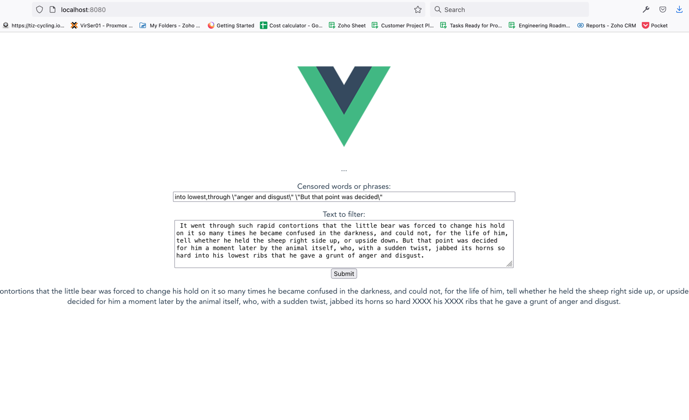

## Wildcard Technical Challenge Project

> This project uses Python 3.9. It also uses sqlite to store various data that the API received.
> The front end is a simple Vuejs page that hits the Django Rest Framework API.
> This is a single page app and does not utilize any of Django's view. 
> You will need to have both Django and vue running at the same time
>
> There is a custom wiretap middleware that I added  that 
> logs all http request and response. You can see what it logs in the 
> django admin page under messages `http://127.0.0.1:8000/admin/wiretap/message/`

>Default port for Django: 8000

>Default port for VueJS: 8080

> Censored words list accepts both single and double quote phrases and space and comma demimited
> 
> Sample censored word lists:  `into lowest,through "anger and disgust" "But that point was decided" 'rapid contortions' "forced to change", twist `


To run django app, please follow the following steps (utilizing pipenv):

* Please make sure you have pipenv install as it comes with pipenv file to facilitate the installation and setup
* Pipenv install instructions located here: https://pipenv.pypa.io/en/latest/install/
* once the above step's complete, run `pipenv install --python 3.9`
* run `pipenv shell` this will activate virtualenvuronment
* run `pipenv install` - this will install all the packages needed
* cd into your project and run `python manage.py migrate`
* there's django admin enabled, you can access it via `http://127.0.0.1:8000/admin/` this is useful to review the filtered document
* if you want to use the django admin, you should create a user by running `python manage.py createsuperuser`

To run django app, please follow the following steps (NOT utilizing pipenv):

* run the following command once you are in your python 3.9 virtual environment: `pip install -r requirements.txt`
* cd into your project and run `python manage.py migrate`
* run the following django command to enable the wiretap middleware `python manage.py setuptap` this automatically setup the middleware to log the url path of a request
* there's django admin enabled, you can access it via `http://127.0.0.1:8000/admin/` this is useful to review the filtered document
* if you want to use the django admin, you should create a user by running `python manage.py createsuperuser`

### REST API

> There is only one endpoint enabled. It accepts the following method: POST


Please use the sample curl request to test the API:

```shell
curl --location --request POST 'http://127.0.0.1:8000/api/words/' \
--header 'Content-Type: application/json' \
--data-raw '{
    "document_text": "It went through such rapid contortions that the little bear was forced to change his hold on it so many times he became confused in the darkness, and could not, for the life of him, tell whether he held the sheep right side up, or upside down. But that point was decided for him a moment later by the animal itself, who, with a sudden twist, jabbed its horns so hard into his lowest ribs that he gave a grunt of anger and disgust.",
    "filtered_words": "into lowest,through \"anger and disgust\" \"But that point was decided\""
}'

```

The JSON should look something like this:

```json
{
    "document_text": "It went through such rapid contortions that the little bear was forced to change his hold on it so many times he became confused in the darkness, and could not, for the life of him, tell whether he held the sheep right side up, or upside down. But that point was decided for him a moment later by the animal itself, who, with a sudden twist, jabbed its horns so hard into his lowest ribs that he gave a grunt of anger and disgust.",
    "filtered_words": "into lowest,through \"anger and disgust\" \"But that point was decided\""
}

```

* document_text - the multiline text that needs to be censored.
* filtered_words - the censored keywords and phrases.

If the post is successful, it will return 201 OK and include the id generated from sqlite.

Sample Response:

```json
{
    "censored_text": "It went XXXX such rapid contortions that the little bear was forced to change his hold on it so many times he became confused in the darkness, and could not, for the life of him, tell whether he held the sheep right side up, or upside down. XXXX for him a moment later by the animal itself, who, with a sudden twist, jabbed its horns so hard XXXX his XXXX ribs that he gave a grunt of XXXX.",
    "id": 14
}

```

### Front end UI

> The Vue front end sends a http request to REST API running on Django.

#### Steps to get started:

* cd into `/wildcard_technical_challenge_project/client`
* run `npm install axios`
* run `npm run serve` - this will run the vue app on port 8080.
* See screenshot below:



#### Selenium Test included to test UI.

* Important: please make sure API is running to perform selenium testing
* run the following python file `python -m unittest ui_test.py` to execute automated tests

#### Django Unit test to test API endpoint

* run the following command `python manage.py test`